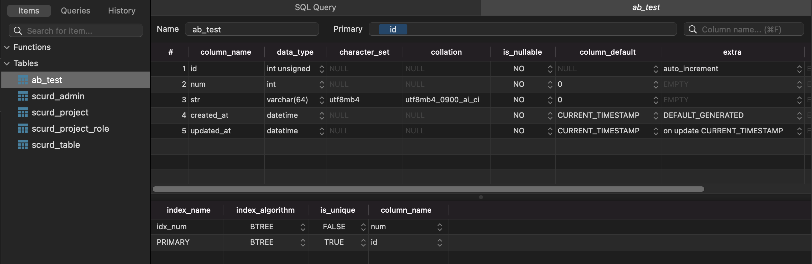
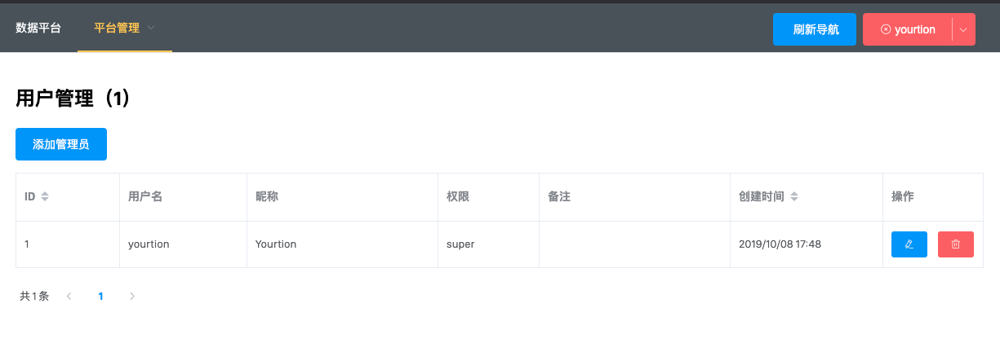
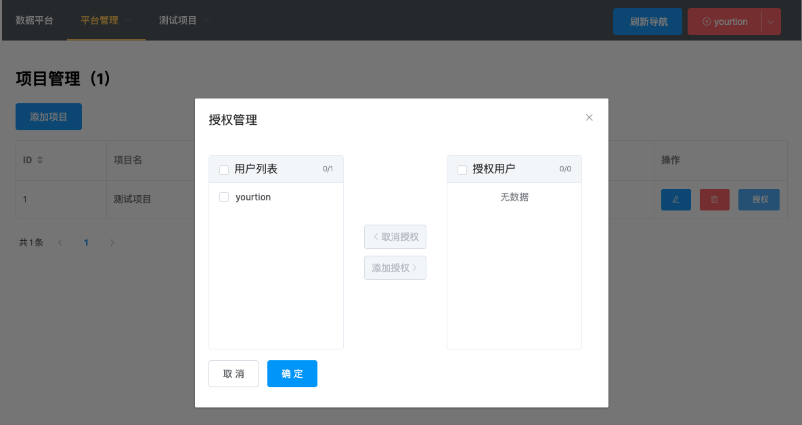
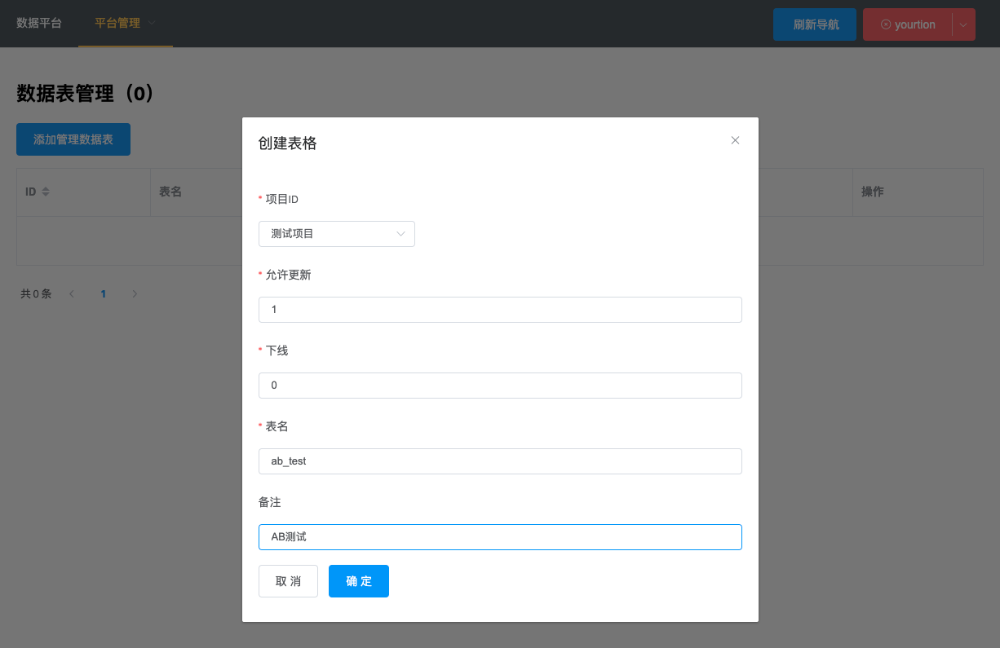
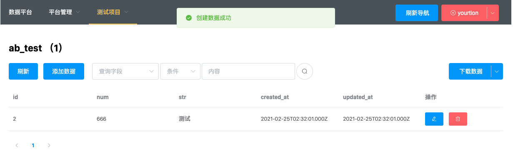
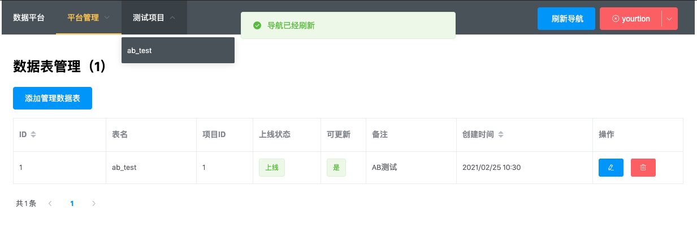
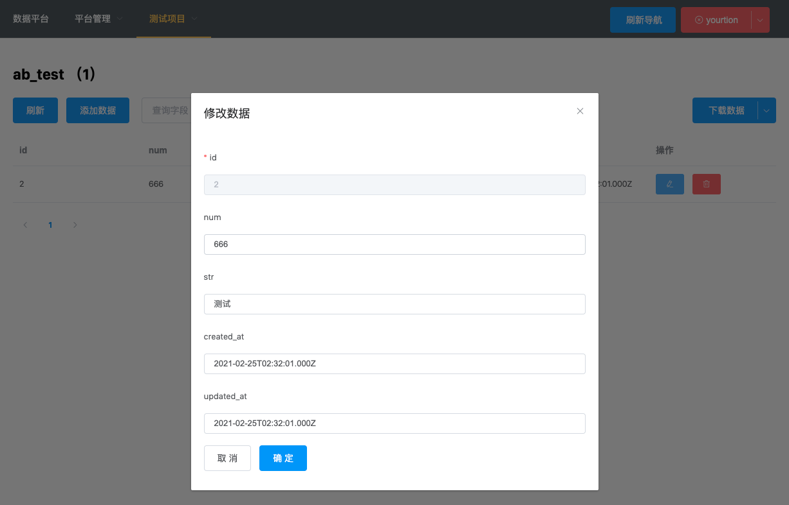

# SimpleCURD

SimpleCURD 是一个简化后端开发，通过管理界面添加相应的数据表即可自动生成前端提交数据的API，以及后台查看管理数据界面的管理工具。

系统使用 ERest 开发，有完善测试代码（[test/api](https://github.com/yourtion/SimpleCURD/tree/master/server/test/api)）与自动生成的文档 [wiki](https://github.com/yourtion/SimpleCURD/wiki/)
## 功能特性

将已存在的数据表在后台添加到系统中，无需任何开发部署，即可获得：

1. 为运营相关人员提供查看下载数据的列表与编辑页面（编辑功能按照数据表字段自动生成）
2. 为前端提供操作表数据的 CURD API 接口（[wiki/collect](https://github.com/yourtion/SimpleCURD/wiki/collect)）
3. 为前端直接提供SDK（[wiki/sdk](https://github.com/yourtion/SimpleCURD/wiki/SimpleCURD-SDK)）
4. 为不同项目提供不同数据的权限管控（查看、可编辑）
## 安装部署

### 开发

```bash
$ cd admin-web && npm run dev
$ cd server && npm run dev
```
### 部署

新建数据库并建立表结构（在 `setup` 目录中的 `sql` 文件）

部署服务端，上传 `server` 文件夹到服务器上（已安装 Node.js 和 pm2），执行：

```bash
$ npm run deploy
```

构建前端 构建后上传到 `server` 所在位置的 `static` 文件夹中的 `admin` 目录（也可以使用其他静态文件服务器）

```bash
$ cd admin-web && npm install && npm run build
$ npm run deploy
```

默认用户名密码：admin / 123456

## 屏幕截图 

测试使用表建表结构如下：

```sql
CREATE TABLE `ab_test` (
  `id` int unsigned NOT NULL AUTO_INCREMENT,
  `num` int NOT NULL DEFAULT '0',
  `str` varchar(64) CHARACTER SET utf8mb4 COLLATE utf8mb4_0900_ai_ci NOT NULL DEFAULT '0',
  `created_at` datetime NOT NULL DEFAULT CURRENT_TIMESTAMP,
  `updated_at` datetime NOT NULL DEFAULT CURRENT_TIMESTAMP ON UPDATE CURRENT_TIMESTAMP,
  PRIMARY KEY (`id`),
  KEY `idx_num` (`num`)
) ENGINE=InnoDB AUTO_INCREMENT=2 DEFAULT CHARSET=utf8mb4 COLLATE=utf8mb4_general_ci COMMENT='测试表';
```



### SDK 使用

```javascript
// 初始化
var client = new DBCURD("test_curd");
// 获取信息
client.info(console.log);
// 获取列表
client.list({ page: 2 }, console.log)
// 创建数据
client.create({
	username: "Yourtion",
}, console.log)
// 更新数据
client.update(23248, { username: "Yourtion2" }, console.log)
// 获取单条记录
client.get(23248, console.log)
// 获取记录和排名
client.rank(23248, "id", console.log)
// 数据记录自增
client.incr(23248, "weight", console.log)
```

### 界面截图

用户管理

- `super` 超级管理员（支持平台管理）
- `editor` 编辑数据
- `viewer` 查看数据



项目管理


支持不同项目对不同用户进行授权，保证数据隔离



添加数据库中已经存在的表





添加后结果

- 状态如果不为“上线”，则无法通过前端API操作
- 状态如果不为“可更新”，则只能通过API插入数据



后台添加/编辑表中的数据（自动根据数据库表结构创建表单）


