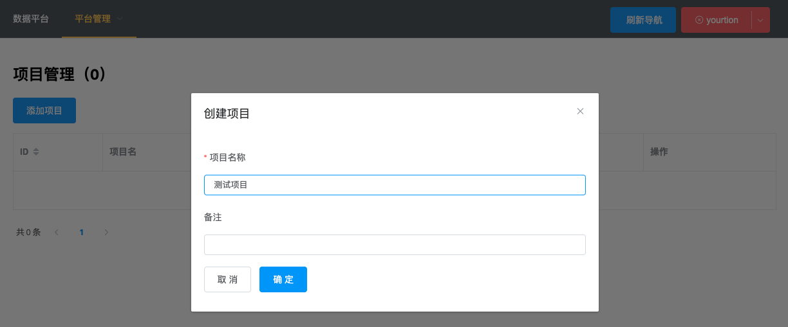

# SimpleCURD

## 功能特性

## 安装部署

### 开发

```bash
$ cd admin-web && npm run dev
$ cd server && npm run dev
```
### 部署

新建数据库并建立表结构（在 `setup` 目录中的 `sql` 文件）

部署服务端，上传 `server` 文件夹到服务器上（已安装 Node.js 和 pm2），执行：

```bash
$ npm run deploy
```

构建前端 构建后上传到 `server` 所在位置的 `static` 文件夹中的 `admin` 目录（也可以使用其他静态文件服务器）

```bash
$ cd admin-web && npm install && npm run build
$ npm run deploy
```

默认用户名密码：admin / 123456

## 屏幕截图 

测试使用表建表结构如下：

```sql
CREATE TABLE `ab_test` (
  `id` int unsigned NOT NULL AUTO_INCREMENT,
  `num` int NOT NULL DEFAULT '0',
  `str` varchar(64) CHARACTER SET utf8mb4 COLLATE utf8mb4_0900_ai_ci NOT NULL DEFAULT '0',
  `created_at` datetime NOT NULL DEFAULT CURRENT_TIMESTAMP,
  `updated_at` datetime NOT NULL DEFAULT CURRENT_TIMESTAMP ON UPDATE CURRENT_TIMESTAMP,
  PRIMARY KEY (`id`),
  KEY `idx_num` (`num`)
) ENGINE=InnoDB AUTO_INCREMENT=2 DEFAULT CHARSET=utf8mb4 COLLATE=utf8mb4_general_ci COMMENT='测试表';
```


### 界面截图

用户管理

- `super` 超级管理员（支持平台管理）
- `editor` 编辑数据
- `viewer` 查看数据


项目管理



支持不同项目对不同用户进行授权，保证数据隔离


添加数据库中已经存在的表


添加后结果

- 状态如果不为“上线”，则无法通过前端API操作
- 状态如果不为“可更新”，则只能通过API插入数据


后台添加/编辑表中的数据（自动根据数据库表结构创建表单）


